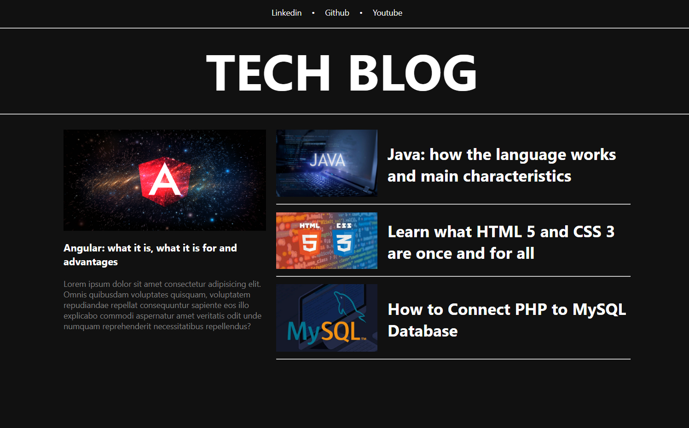

# Tech Blog



Este projeto é um Blog de Tecnologias desenvolvido utilizando o framework Angular. Foi criado como parte do desafio proposto pela Digital Innovation One (DIO) para demonstrar habilidades no desenvolvimento web com Angular.

## Visão Geral

O Blog de Tecnologias é uma aplicação web que permite aos usuários acessar artigos relacionados a diferentes tecnologias. Os artigos são exibidos em cards, proporcionando uma visão geral do conteúdo. Os usuários podem clicar em um artigo para obter mais detalhes, incluindo uma imagem de capa, título e descrição completa.

## Funcionalidades

- Visualização de artigos: Os usuários podem visualizar uma lista de artigos com informações resumidas.
- Detalhes do artigo: Os usuários podem clicar em um artigo para ver mais detalhes, incluindo uma imagem de capa, título e descrição completa.
- Navegação: A aplicação possui navegação que permite aos usuários explorar diferentes seções e artigos.

## Estrutura do Projeto

O projeto é estruturado de forma modular, com diferentes componentes para representar os elementos da interface do usuário:

- `app-menu-title`: Componente para exibir o título ou cabeçalho do menu.
- `app-big-card`: Componente para exibir um card de artigo com informações resumidas.
- `app-small-card`: Componente para exibir um card de artigo menor com informações resumidas.
- `app-menu-bar`: Componente para exibir o menu de navegação.

Além disso, o projeto inclui rotas gerenciadas pelo Angular Router para possibilitar a navegação entre diferentes páginas e visualização de artigos.

## Como Executar o Projeto

Para executar este projeto em sua máquina local, siga os passos abaixo:

1. Certifique-se de que você possui o Angular CLI instalado. Caso contrário, instale-o executando o seguinte comando:
   
   ```bash
   npm install -g @angular/cli

2. Clone este repositório para sua máquina:
   
   ```bash
   git clone <URL_do_repositorio>
   cd blog-tecnologias-angular

3. Instale as dependências do projeto:
   
   ```bash
   npm install
   
4. Inicie a aplicação: 

   ````bash
   ng serve
    
5. Acesse a aplicação em seu navegador no seguinte endereço: http://localhost:4200/
